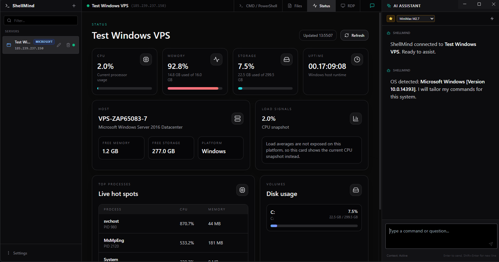

# ShellMind

> Version 0.3.3

ShellMind is a self-hosted remote workspace that combines terminal access, file management, remote desktop, and AI assistance in one focused interface.

It is designed for day-to-day server work across SSH, PowerShell, FTP, SFTP, and S3-compatible storage while keeping the workflow fast, local, and practical.

## Screenshot



## What is new in 0.3.2

An AI and security release: the assistant finally has real conversation memory, answers stream in live, MiniMax M3 joins the model list, and connection credentials stop traveling through the browser.

**AI assistant**
- **MiniMax M3** is now available alongside M2.7, with automatic fallback to M2.7 on provider limits and a larger token budget for its reasoning.
- **Real multi-turn context**: the assistant now receives the conversation history, so follow-up questions and corrections work naturally. The system prompt also rides in the proper `system` channel for MiniMax.
- **Live streaming responses**: text appears as it is generated, and Stop now cancels the actual provider request instead of just hiding the answer.
- **Conversations persist per server**: chat history survives reloads and server switches, and can be cleared from the chat header.
- **Environment-aware commands**: in scoped CLI consoles (`docker>`, `az>`, …) the AI now emits bare subcommands (`ps -a`, never `docker ps -a` or `docker> ps`), and the console itself normalizes prompt artifacts in pasted or AI-run lines.
- Auto-run now waits for the terminal to go quiet (up to 45 s) instead of a fixed 4 s, so long commands get their full output analyzed.
- The off-topic keyword filter only applies to the first message of a conversation, removing false positives mid-chat.

**Security**
- Connection secrets (passwords, SSH private keys, passphrases, S3 secret keys) **never leave the backend** anymore: the frontend connects by server id and credentials are resolved server-side. `GET /api/servers` no longer returns secrets.
- The HTTP API and the socket (including raw WebSocket upgrades) now enforce an **origin allowlist** (localhost + `ALLOWED_ORIGINS`), so arbitrary web pages can't read the API or drive connections from your browser.
- Edit forms show "Saved — leave blank to keep" for stored secrets, and server logs no longer print credentials.

## What is new in 0.3.0

A major interface and usability overhaul focused on making ShellMind a tool you can live in all day.

**Terminal**
- Full clipboard support in SSH/PowerShell/FTP sessions: paste with `Ctrl+V` / `Ctrl+Shift+V`, right-click menu, and middle-click paste. Pasting respects bracketed-paste mode.
- Copy the current selection with `Ctrl+Shift+C` (and `Cmd+C` on macOS); plain `Ctrl+C` still sends `SIGINT` when nothing is selected, or copies when there is a selection.
- A right-click context menu with copy, paste, select all, clear, and "ask AI about output".
- A live connection-state indicator (connecting / connected / disconnected / error) with a one-click **Reconnect** when a session drops or fails.
- A redesigned in-terminal toolbar grouping clipboard, search, history and AI hints.

**File manager**
- Drag & drop upload (multiple files at once) with a live upload progress dock.
- Clickable breadcrumb path navigation (double-click to type a path).
- Multi-select with a bulk-delete action bar.
- File-type icons, folders-first sorting, skeleton loading states, and an empty-state hint.
- Errors and results now surface as toasts instead of blocking `alert()` dialogs.

**AI assistant**
- Stop a response mid-generation.
- Copy any assistant message and re-generate the last answer.
- Cleaner code blocks with copy + run, and improved Markdown rendering.

**Across the app**
- A unified dark design system (consistent surfaces, accent color, animations).
- Toasts and in-app confirm dialogs replace native `confirm()`/`alert()` and full-page reloads.
- Password fields now have show/hide toggles; connections are grouped by type in the sidebar.
- macOS gets a proper Edit menu so clipboard shortcuts work in every input.

## What is new in 0.2.0

- MiniMax M2.7 support through the Anthropic-compatible API.
- MiniMax M2.7 is included for free for the full duration of the alpha.
- Gemini and MiniMax API keys can now be configured independently.
- Saved API keys can now be updated or removed directly from the settings modal when they are not locked by environment variables.
- MiniMax M2.7 is now the default and recommended AI model.
- AI model selection UI has been refined with cleaner recommendation styling.
- The Status tab is now a visual live dashboard for CPU, memory, storage, uptime, and top processes.
- Status loading and refresh states now show clear visual feedback.
- The noisy floating SSH issue warning in chat was removed.
- Existing SSH issue analysis and quick-fix tools remain available in the chat panel.
- README and environment configuration were updated for multi-provider AI usage.

## Core features

### AI Assistant
- Chat with the active server in context.
- Use Gemini or MiniMax models (M2.7 and M3) from the same assistant.
- The assistant remembers the current conversation: follow-up questions keep the full multi-turn context.
- Responses stream in live, and Stop actually cancels the upstream provider request.
- Conversations are saved per server and survive reloads and server switches; clear them anytime from the chat header.
- Send terminal code blocks to the shell with one click.
- Stop generation mid-stream, copy any answer, and re-generate the last response.
- Enable Auto-Run for trusted command execution.
- Use `Analyze` and `Fix it` when SSH failures are detected.

### Terminal
- SSH terminal for Linux and Unix-like servers.
- PowerShell and SSH support for Windows servers.
- Full clipboard support: paste (`Ctrl+V` / `Ctrl+Shift+V` / right-click / middle-click) and copy (`Ctrl+Shift+C`), with `Ctrl+C` preserved for `SIGINT`.
- Right-click context menu for copy, paste, select all and clear.
- Live connection status with one-click reconnect when a session drops.
- Visual live status dashboard for Linux and Windows system checks.
- Automatic detection of common SSH failures from terminal output.
- Highlighted error lines and clickable links directly in the terminal.
- Built-in terminal search and quick clear controls.

### Local CLI
- **Scoped tool consoles** for Azure CLI, AWS CLI, Google Cloud, Kubernetes and Docker: a dedicated `az>` / `aws>` / `docker>` prompt that only runs that tool's subcommands (no full shell access). Includes **persistent command history** (↑/↓, kept across sessions), **Tab autocompletion** of common subcommands, a **Quick Commands** panel, `Ctrl+L` to clear and `exit` to close. It detects the installed version (shown to the AI) and links the official installer when the CLI is missing.
- **System shell** preset for a real local terminal (PowerShell / bash) via a true PTY (`node-pty`), and **Custom** mode to launch any program (e.g. `wsl -d Ubuntu`).
- The AI assistant stays available, so you can ask it to build `az`/`aws`/`kubectl` commands as you go (it knows it's a scoped console).

### File management
- Browse, upload, download, delete, rename, and create folders.
- Drag & drop multi-file upload with a live progress dock.
- Breadcrumb path navigation and multi-select bulk delete.
- SFTP and FTP support for remote file operations.
- S3 bucket browsing with folder marker support.
- Folder creation and rename actions via modal dialogs.
- AI assistant is disabled for S3 to keep the experience focused.

### Remote access
- Native RDP launch for Windows servers.
- Unified server switching from the sidebar.

## Getting started

### Requirements
- Node.js
- A Gemini API key if you want to use Gemini

MiniMax M2.7 is included for free during the full alpha through the ShellMind private proxy. Adding your own MiniMax API key is optional.

### Install

```bash
git clone https://github.com/Luisbh-dev/shellmind.git
cd shellmind
npm install
```

### Configure

Create a `.env` file in the project root:

```env
GEMINI_API_KEY=your_api_key_here
MINIMAX_API_KEY=your_optional_minimax_key_here
```

For web deployments behind a custom origin, you can also set `VITE_API_BASE` at build time to point the frontend at your backend (defaults to `http://localhost:3001`).

The backend only accepts browser requests from localhost (and requests without an Origin, e.g. the desktop app). If you host the web build behind a custom origin, allow it with `ALLOWED_ORIGINS=https://your-origin.example` (comma-separated). Saved connection secrets (passwords, private keys, S3 secret keys) never leave the backend: the frontend connects by server id and credentials are resolved server-side.

You can also configure Gemini and MiniMax API keys from the app settings.
If a key was saved in the app database instead of environment variables, you can update or delete it later from the settings modal.

MiniMax traffic now always goes through the ShellMind private proxy at `https://ia.shellmind.app`.

- `MINIMAX_API_KEY`: optional user BYOK key. If it is configured, ShellMind forwards it to the proxy. If not, the proxy uses its own server-side MiniMax key.

### Run

```bash
npm start
```

This starts the frontend and backend together.

## Desktop build note

For the public GitHub repository, do not commit provider API keys.

For private desktop builds, prefer injecting secrets at build or runtime instead of hardcoding them in the repository. If the app will be distributed broadly, the safest approach is to route AI traffic through your own backend or proxy and keep the provider key only on infrastructure you control.

## Release notes

### 0.3.3
- Security maintenance: resolved all known dependency advisories (`npm audit` reports 0 vulnerabilities, down from 41).
- Patched runtime/production dependencies: `basic-ftp` (path traversal), `socket.io-parser`, `ws`, `engine.io`, `express`/`path-to-regexp`/`qs`, and `node-forge` (certificate-chain validation, via the RDP libraries).
- Upgraded `sqlite3` 5 → 6 (prebuilt binaries, drops the vulnerable `node-gyp`/`tar`/`cacache` build chain) and the dev-only `concurrently` 9 → 10 (removes the `shell-quote` advisory). No application code changes.

### 0.3.2
- MiniMax M3 enabled (Anthropic-compatible API) with automatic fallback to M2.7 and a larger reasoning token budget.
- The AI assistant now receives the conversation history (multi-turn context) for both MiniMax and Gemini.
- Chat responses stream live over SSE; Stop aborts the upstream provider request.
- Conversations are persisted per server in SQLite and restorable across reloads; a clear-conversation button was added to the chat header.
- Scoped CLI consoles: the AI generates bare subcommands for the active console, and `runLine` normalizes `tool>` prompts and repeated tool names in pasted input.
- Auto-run waits for terminal quiescence (up to 45 s) instead of a fixed 4 s before analyzing output.
- The out-of-scope keyword filter only gates the first turn of a conversation.
- Security: `GET /api/servers` no longer returns secrets (has_* flags instead); connections resolve credentials server-side by server id; origin allowlist on HTTP + socket (`ALLOWED_ORIGINS` for custom web origins); secret-preserving edits ("leave blank to keep"); credential-free server logs.
- The backend port can be overridden with the `PORT` env var.

### 0.3.1
- Hotfix: large file uploads no longer stall. Uploads are now streamed in acked chunks (with a per-file progress bar / percentage) instead of a single oversized socket message.
- True streaming uploads across all backends: SFTP (write stream), FTP (`PassThrough` → `uploadFrom`), and S3 (multipart via `@aws-sdk/lib-storage` — no in-memory buffering, no 5 GB single-object cap).

### 0.3.0
- New **Local CLI** connection type: scoped tool consoles (`az>`, `aws>`, `docker>`, …) that only run that tool's subcommands and surface your identity on connect, plus a full **System shell** (via `node-pty`) and a custom-command mode. Detects missing CLIs and links the installer.
- Terminal clipboard support: paste (`Ctrl+V`, `Ctrl+Shift+V`, right-click, middle-click) and copy (`Ctrl+Shift+C`), with bracketed-paste handling and `Ctrl+C` preserved for `SIGINT`.
- Terminal right-click context menu and a live connection-state indicator with one-click reconnect.
- File manager: drag & drop multi-file upload with progress, breadcrumb navigation, multi-select bulk delete, file-type icons and skeleton loading.
- AI assistant: stop generation, copy messages, re-generate responses, and improved code blocks.
- Unified dark design system with reusable UI primitives (modals, toasts, confirm dialogs, buttons, inputs).
- Native `alert()` / `confirm()` dialogs and full-page reloads replaced with in-app toasts and confirm modals.
- Password fields gained show/hide toggles; sidebar connections are grouped by type.
- macOS Edit menu added so clipboard shortcuts work across all inputs.
- The workspace header and AI chat now reflect the real connection state (connecting / connected / failed) instead of always showing "connected".
- The Status dashboard is now fault-tolerant and portable across distros: CPU is sampled from `/proc/stat` (no dependency on `top`), disks use POSIX `df -P -k`, and processes fall back to a busybox-friendly listing — so it works on minimal images like Alpine, and a single unsupported command degrades only that metric instead of failing the whole panel.

### 0.2.0
- MiniMax M2.7 integrated through the Anthropic-compatible API.
- Gemini and MiniMax keys can be stored separately in settings.
- MiniMax M2.7 is now the default model.
- AI selector UI was cleaned up and recommendation styling was improved.
- The Status tab was rebuilt as a visual dashboard with live host metrics.
- Status loading and refresh feedback were improved.
- Chat no longer shows the floating SSH issue warning banner.

### 0.1.9
- Terminal search and clickable URLs added to xterm.
- SSH error lines are now highlighted directly in the terminal.
- File explorer now supports modal-based create folder and rename flows.
- AI Hints and terminal controls were polished for a cleaner workflow.
- Auto-Run confirmation and SSH error analysis were refined.

### 0.1.8
- SSH issue detection and `Fix it` workflow introduced.

## License

MIT License. Created by [Luisbh-dev](https://github.com/Luisbh-dev).
